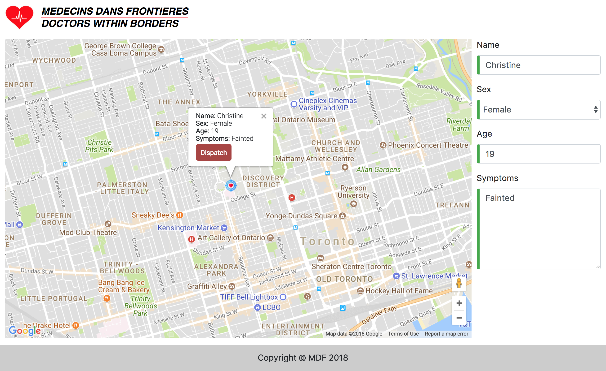

# Doctors Within Borders
### A crowdsourcing app that improves first response time to emergencies by connecting city 911 dispatchers with certified civilians

## 1. The Challenge

In Ontario, ambulances get to the patient in 9 minutes 90% of the time. We all know that
that the first few minutes after an emergency occurs is critical, and the difference of
just a few minutes could mean the difference between life and death.
Doctors Within Borders aims to get the closest responder within 5 minutes of
the patient to arrive on scene so as to give the patient the help needed earlier.

## 2. Main Features

### a. Web view: the dispatcher

### b. Mobile view: the Doctor

## 3. The Technology

Created by Asic Chen, Christine KC Cheng, Andrey Boris Khesin and Dmitry Ten.
